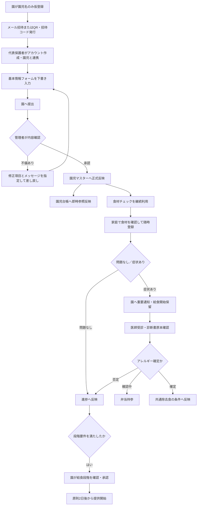

# Ohana Works 入園時基本情報・食材チェック機能 設計指示書案

## 0. Claudeへの依頼事項

本書は、現在構築中の「Ohana Works」へ、次の2機能を追加するための設計指示書案である。

1. 入園時基本情報フォームおよび園児マスター・園児台帳への連携
2. 離乳食の食材チェック、給食段階判定、アレルギー確認および保護者通知

Claudeは、本書をそのまま最終仕様とみなして実装指示へ変換するのではなく、現在のOhana Worksの実装、既存設計書、データ構造、権限体系、保護者アプリ、通知機能、園児マスター、園児台帳、デイリーボード、献立・給食管理機能とのFit & Gapを確認したうえで、本番用の設計指示書へ書き換えること。

本書に記載した業務ルールは原則として維持し、既存実装との都合だけで変更しないこと。既存実装との不一致がある場合は、次のいずれかに分類して報告すること。

- 既存機能をそのまま再利用できる
- 既存機能の拡張で対応できる
- 新規機能・新規データが必要である
- 既存仕様と業務ルールが衝突しており、運用責任者の判断が必要である

本番設計では、少なくとも画面仕様、項目定義、状態遷移、権限、データモデル、API・イベント連携、通知、監査履歴、例外処理、移行方法、テストケース、受入条件まで具体化すること。

## 1. 文書の位置づけ

### 1.1 目的

入園時の紙による情報収集と園職員による転記を廃止し、保護者が保護者アプリから直接情報を入力できるようにする。園が確認・承認した情報を園児マスターの正本へ反映し、一般職員向けの園児台帳から安全に参照できるようにする。

同時に、現在紙で運用している食材チェック表を保護者アプリへ移行し、保護者が随時入力できるようにする。食材経験、給食段階、医師の診断に基づくアレルギー管理を明確に分離し、安全な給食提供可否をシステムで判定できるようにする。

### 1.2 今回の対象範囲

- 園児名のみを用いた入園予定児の仮登録
- 保護者招待と保護者アカウント作成
- 入園時基本情報フォーム
- 下書き、進捗表示、提出、差し戻し、再提出、承認
- 園児マスターおよび園児台帳への連携
- 入園後の登録情報変更申請
- 年度初め等の定期確認
- 食材チェック表の電子化
- 食材チェック項目マスター
- 保護者による食材経験・症状の登録
- 園による確認、給食段階の承認、提供可否判定
- アレルギー診断書の提出状況管理
- 給食開始保留、弁当持参、共通除去食の管理
- 保護者および園職員への自動通知
- デイリーボード、園児台帳、献立・給食管理との連携
- 履歴、監査、帳票出力に必要なデータ保持

### 1.3 今回の対象外

- 出生時記録という独立帳票の作成
- 健康保険情報の収集
- FAX番号の収集
- 血液型の収集
- 出生時の父母年齢の収集
- 予防接種名、接種日、接種回数等の詳細管理
- 好き嫌いを理由とした給食の個別変更
- 食材チェック項目を年齢到達だけで一律に催促する機能
- 次回の献立で使用する食材だけを優先して催促する機能
- 月1回の紙の食材チェック表受け渡しを前提とした運用
- 医療行為、投薬、医療的ケアを園職員が実施する機能

## 2. 参照資料と仕様の優先順位

### 2.1 参照資料

- 「入園児の基本情報.pdf」
- 「食材チェック表.pdf」
- 「離乳食の進め方と食材チェック表について.docx」
- 本件について運用責任者から提示された会話上の確定事項
- 既存Ohana Worksの設計書および実装

### 2.2 優先順位

矛盾がある場合は、次の順で採用すること。

1. 運用責任者が会話上で明示した最新の確定事項
2. 現在の正式な園運用資料
3. 紙様式に記載された既存項目
4. 既存Ohana Worksの実装
5. 設計者による推奨案

資料中に記載された「月1回の確認」「紙の提出」等の旧運用は、保護者アプリから随時確認・更新する運用へ置き換えること。

## 3. 用語と正本の定義

| 用語 | 定義 |
|---|---|
| 園児マスター | 管理者以上が管理する園児情報の正本。保護者情報、住所、健康情報、所属期間等を保持する |
| 園児台帳 | 園児マスター等の情報を参照する一般職員向け画面。正本を複製して別管理しない |
| 入園予定児 | クラス所属開始日前であるが、保護者アプリの利用および事前入力を開始している園児 |
| 代表保護者 | 最初に招待され、入園時基本情報フォームを入力・提出する保護者 |
| 食材経験 | 家庭で対象食材を複数回食べ、症状がなかったことを保護者が登録した事実 |
| 症状あり | 対象食材を食べた後に何らかの症状が発生したと保護者が登録した状態。診断の確定を意味しない |
| アレルギー確定 | 医師の診断書を園が原本で確認し、除去対象として正式登録した状態 |
| 給食段階 | 初期食、中期食、後期食、完了食、幼児食等の提供段階 |
| 給食開始保留 | 食材チェックや医師確認等が未完了で、園の給食をまだ開始できない状態 |
| 共通除去食 | 同一施設・同一提供日に除去が必要な園児がいる場合、その食事で必要となる全除去対象食材を使用せずに作る一種類の食事。園児ごとの個別献立ではない |

## 4. Ohana WorksとのFit & Gap確認

Claudeは本番設計作成前に、次を実装または既存設計書から確認すること。

### 4.1 園児・保護者データ

- 園児マスターの主キーと仮登録状態
- 園児名のみで登録できるか
- 保護者アカウントと複数園児の紐付け方法
- 兄弟姉妹間で共有できる世帯情報の構造
- 園児マスターと園児台帳が同一データを参照しているか
- 履歴型データと現在値の保持方法
- クラス所属開始日・終了日
- 保護者アプリ利用開始日・終了日
- 写真販売等のサービス利用終了日

「システム利用開始日・終了日」と「施設在籍開始日・終了日」は独立項目として増やさず、保護者アプリ利用開始日・終了日に準ずる設計とする。ただし、既存システム上で施設在籍期間が他機能の必須条件になっている場合は、内部項目として保持する必要性をFit & Gapで明示し、画面上の二重入力は避けること。

### 4.2 権限

- 管理者、主任、園長、統括管理者等の既存権限名と階層
- 「管理者以上」が既存システム上でどの役割に相当するか
- 施設横断権限と所属施設限定権限
- 承認操作、原本確認、監査履歴参照の権限

### 4.3 保護者アプリ

- 招待メール、QRコード、招待コードの既存機能
- 下書き保存、差し戻し、プッシュ通知の基盤
- 年度更新・再確認機能の有無
- 複数保護者と代表保護者の扱い

### 4.4 給食関連

- 献立マスター、料理、食材、アレルゲンの既存データ
- 園児別の給食段階または食事形態の既存項目
- 調理室・給食担当者向け画面の有無
- デイリーボードに表示できる食事制限・弁当持参情報
- 食材チェックと献立食材を将来接続できるID設計

### 4.5 通知・監査

- 保護者向けプッシュ通知、メール、アプリ内通知
- 園職員向け重要通知、未処理一覧、バッジ表示
- 閲覧・変更・承認・出力履歴の共通基盤

## 5. 権限方針

| 操作 | 権限 |
|---|---|
| 園児名のみの仮登録 | 管理者以上 |
| 保護者招待の発行・再発行 | 管理者以上 |
| 入園時基本情報の入力・下書き・提出 | 代表保護者 |
| 提出内容の確認・差し戻し・承認 | 管理者以上 |
| 正式な園児基本情報の変更 | 管理者以上 |
| 園児台帳からの基本情報閲覧 | 所属施設の一般職員以上。ただし入園前・卒退園後は管理者以上 |
| 食材経験の入力 | 代表保護者または当該園児に紐付く保護者 |
| 食材チェックの閲覧 | 当該保護者、所属施設の一般職員以上 |
| 食材の「問題なし」確認、症状確認、給食段階承認 | 本番設計で既存権限に割り当てる。初期案は主任以上 |
| アレルギー診断書の原本確認・正式登録 | 管理者以上。園の運用に応じて園長以上への引上げ可 |
| 食材チェック項目マスターの変更・版公開 | 主任以上。ただし公開承認を管理者以上とすることを検討 |
| 監査履歴の閲覧 | 管理者WEBの統括管理者以上 |

一般職員が園児台帳から住所、保護者、勤務先、健康上の正本情報を直接変更できないようにすること。

## 6. 全体業務フロー



## 7. 園児の仮登録と招待

### 7.1 園側の仮登録

園側は入園予定児について、最初に園児名だけを園児マスターへ仮登録できるようにする。既存実装で必須となる場合のみ、内部的な仮ID、所属予定施設、保護者アプリ利用開始日等を合わせて保持する。

仮登録時点では、通常のデイリーボードや在園児一覧へ表示しない。クラス所属開始日が到来した時点で、通常の保育業務画面へ表示する。

### 7.2 招待方法

次の両方に対応する。

- 園が保護者のメールアドレスを仮登録し、招待メールを送る
- 園がQRコードまたは招待コードを発行し、紙等で保護者へ渡す

招待情報は一度だけ利用できる、または有効期限を持たせる。紛失・期限切れの場合は管理者以上が旧招待を無効化して再発行する。

### 7.3 本人・園児紐付け

- 基本情報フォームへ入る前に保護者アカウントを作成する
- 最初に招待された保護者を代表保護者とする
- 招待情報から仮登録済み園児へ紐付ける
- 招待コードだけで園児の個人情報を表示しない
- 既に兄弟姉妹の保護者アカウントを持つ場合は、既存アカウントへ新しい園児を追加する

### 7.4 兄弟姉妹の情報複製

既存情報から次を複製候補として表示できるようにする。

- 世帯住所
- 保護者氏名、続柄、電話番号
- 保護者の勤務先
- 緊急連絡先
- 同居家族
- 送迎・引き渡し可能者

複製後は新しい園児の入力データとして独立して確認・修正できるようにする。兄弟の情報を更新しただけで他児童の確定済み情報を自動上書きしない。

## 8. 入園時基本情報フォーム

### 8.1 入力体験

- 複数ステップに分割する
- 「全10段階中3段階」「入力完了率30%」等、全体進捗を常時表示する
- ステップ単位および自動で下書き保存する
- 後日、保存した位置から再開できる
- 必須項目の不足をステップごとに表示する
- 提出前に全項目の確認画面を表示する
- 保護者が「園へ提出」を押すまでは未確定情報として扱う
- 園側には未提出の詳細情報を通常の確定情報として表示しない。ただし健康・医療上の要確認情報は、提出時に目立つ形で確認できるようにする

### 8.2 推奨ステップ

1. 園児基本情報
2. 住所・世帯情報
3. 保護者・勤務先・連絡先
4. 緊急連絡先・送迎・引き渡し可能者
5. 家族・兄弟姉妹情報
6. 出生・生育歴
7. 健康・医療・アレルギー
8. 食事・睡眠・排泄・生活習慣
9. 性格、遊び、家庭の希望
10. 食材チェックの初期登録および最終確認

既存アプリのフォーム部品や画面構成に適合させて段階数は変更してよいが、進捗が見え、途中保存できる要件は維持すること。

## 9. 基本情報の項目定義

### 9.1 園児基本情報

| 項目 | 必須 | 備考 |
|---|---:|---|
| 園児氏名 | 必須 | 園が仮登録した氏名を初期表示。保護者が変更した場合は差分承認対象 |
| ふりがな | 必須 | 全角ひらがなを基本とする |
| 愛称 | 任意 | 日常保育での呼び名 |
| 性別 | 必須 | 成長曲線等の基準判定に利用する場合は既存定義と統一 |
| 生年月日 | 必須 | 月齢、食事段階の年齢条件に利用 |
| クラス所属開始日・終了日 | 園入力 | 保護者入力対象外 |
| 保護者アプリ利用開始日・終了日 | 園入力 | 事前説明期間を含めて設定可能 |
| 写真販売等サービス利用終了日 | 園入力 | 卒園後の写真販売期間等を管理 |

血液型は収集しない。

### 9.2 住所

| 項目 | 必須 | 備考 |
|---|---:|---|
| 世帯郵便番号 | 必須 | 7桁。ハイフン有無を許容し保存形式を統一 |
| 世帯住所 | 必須 | 都道府県、市区町村、町域、番地、建物名を分離可能にする |
| 園児住所 | 必須 | 世帯住所と同じ場合はコピー。別居等に対応 |

「郵便番号から住所候補を表示」とは、7桁の郵便番号を入力すると、都道府県・市区町村・町域を自動入力し、保護者が番地・建物名を追加入力する機能を意味する。自動入力結果は保護者が修正できるようにする。

### 9.3 保護者情報

保護者は複数人登録でき、各保護者に次を持たせる。

- 氏名、ふりがな
- 園児との続柄
- 同居・別居
- 代表保護者フラグ
- 連絡優先順位
- 携帯電話番号
- 自宅電話番号
- 勤務先電話番号
- 勤務先の直通携帯電話番号
- メールアドレス
- 勤務先名
- 勤務先郵便番号・住所
- 勤務先部署名等の補足

電話番号の種別を明確にし、園児台帳ではタップして電話をかけられるようにする。住所は地図を開けるようにする。

### 9.4 緊急連絡・送迎・引き渡し

- 緊急連絡先の氏名、続柄、電話番号、連絡優先順位
- 通常の送り担当者
- 通常の迎え担当者
- 代理送迎者・引き渡し可能者
- 各代理者の続柄、電話番号、本人確認に使う情報
- 通園方法
- 所要時間

代理送迎者は複数登録できること。将来の災害時引き渡し機能と同じ人物データを参照できる構造とする。

### 9.5 家族・兄弟姉妹

- 同居家族の氏名、ふりがな、続柄、生年月日、職業または学校等
- 兄弟姉妹の氏名、生年月日、在籍施設、在籍状況
- 同一のOhana Works環境内に園児データがある場合は内部的に紐付ける

### 9.6 出生・生育歴

- 在胎週数または妊娠月数
- 第何子か
- 出生時身長
- 出生時体重
- 出生時・新生児期の特記事項
- 授乳方法（母乳、混合、人工等）
- 断乳または離乳時期
- 離乳食開始時期
- 首すわり、おすわり、はいはい、初歯、初語等の時期
- これまでの養育者・生育環境

出生時の父母年齢は収集しない。

### 9.7 健康・医療

- かかりつけ医の医療機関名、電話番号、住所
- 既往歴、発症時期、現在の状態
- けいれん、脱臼、繰り返しやすい疾病等の特記事項
- アレルギーの有無
- 疑われる原因食材または物質
- 医師の診断の有無
- 診断書の提出状況
- 園生活上の注意事項
- 平熱

平熱は摂氏、小数第1位まで入力できるようにする。37.5℃以上が入力された場合は、入力欄付近と確認画面へ次の注意を明示する。

> 平熱が37.5℃以上で登録されています。医師の診断書がない限り、体温が37.5℃に達した時点でお迎えを要請します。

この警告は、保護者入力だけで園の運用基準を変更するものではない。園の確認・承認対象とする。

### 9.8 服薬情報

- 薬品名
- 使用条件・使用時期
- 保護者から申し出のあった内容
- 園で必要となる配慮・参照情報

大前提として、本件の対象施設には看護師が常駐しておらず、園職員は医療行為を行わない。画面や文言に「園が投薬する」「園が処置する」と誤解される表現を設けない。服薬情報は緊急時や保育上の配慮のための参照情報として扱う。

### 9.9 健診・予防接種

各乳幼児健診および予防接種について、今回収集するのは「受けた／受けていない」のみとする。接種日、ワクチン名、接種回数、結果等の詳細項目は設けない。

既存紙票に列挙された健診・予防接種名を初期選択肢の参考にしてよいが、年度や制度改定に対応できるマスター構造とする。

### 9.10 生活状況

紙票にある内容を、回答しやすい選択肢と自由記述へ再構成する。

- 授乳回数、量、夜間授乳、使用ミルク
- 離乳食・食事の回数、量、食べ方
- 自分で食べる状況、使用器具、食事中の様子
- 好きな食べ物、苦手な食べ物、間食
- 起床、就寝、昼寝、寝る姿勢、添い寝等
- 排尿・排便、紙おむつ・布おむつ、排泄の自立状況
- 手洗い、洗顔、うがい、歯磨き、鼻をかむ等
- 着脱できる衣類、援助が必要な衣類
- 言葉の発達や伝わり方
- 人見知り、他児との遊び、一人遊び、大人との関わり
- 好きな遊び、玩具、興味

好き嫌いの情報は保育理解のために保持してよいが、給食除去や提供可否の判定には使わない。

### 9.11 家庭の考え・自由記述

- 保護者から見た園児の良いところ
- 心配していること、気になる癖
- どのように育ってほしいか
- 子育てで大切にしていること
- 園への希望
- 健康・身体上の特記事項
- その他伝えておきたいこと

職員専用の面談所感、担当者、確認欄は保護者フォームに表示せず、園側の確認画面で入力する。

### 9.12 削除項目

次は紙票に存在していても新フォームでは収集しない。

- 健康保険の種類、記号、番号、保険者名
- FAX番号
- 血液型
- 出生時の父母年齢

## 10. 提出・差し戻し・承認

### 10.1 状態

入園時フォームは、少なくとも次の状態を持つ。

- 招待前
- 招待済み
- 入力中
- 提出済み
- 園確認中
- 差し戻し
- 再提出済み
- 承認済み
- 取消・無効

### 10.2 提出時チェック

- 必須項目の入力
- 電話番号、メール、郵便番号、日付等の形式
- 園児の生年月日と各年月の整合
- 同一人物・同一連絡先の重複候補
- 平熱37.5℃以上の警告確認
- アレルギー、服薬、既往歴等の要確認情報
- 食材チェックの症状あり情報

### 10.3 園側確認

園側の確認画面では次を分けて表示する。

- 園が仮登録した値
- 保護者が提出した値
- 差分
- 要確認の健康・医療情報
- 不足項目
- 差し戻し対象項目とメッセージ

園が先に登録した情報を保護者提出内容で自動上書きしない。承認者が差分を確認して反映する。

### 10.4 承認後

- 園児マスターの正本を更新する
- 園児台帳は同一正本を参照して即時更新する
- 承認者、承認日時、提出版を記録する
- 保護者へ承認完了を通知する
- 承認済みの提出スナップショットを履歴として保持する

## 11. 入園後の変更と定期確認

### 11.1 変更申請

保護者は入園後も、住所、電話番号、勤務先、緊急連絡先等の変更を同じ画面から申請できる。申請内容は即時反映せず、管理者以上の承認後に園児マスターと園児台帳へ反映する。

### 11.2 定期確認

年度初め等に、保護者へ現在の登録情報の確認を依頼できるようにする。

- 「変更なし」または「修正して提出」を選べる
- 最終確認日、確認者を記録する
- 未確認者を園側で一覧できる
- 既存通知基盤を利用して自動リマインドできる

通知日程は施設別に変更可能とし、本番設計で既存の年度更新処理と統合する。

## 12. 食材チェック機能の基本方針

### 12.1 目的

- 保護者が家庭で食べた食材を随時記録できる
- 紙のチェック表を園へ持参しなくても、園と保護者が同じ進捗を確認できる
- 園側の個別連絡や月1回の回収を前提にせず、自動通知する
- 食材経験と医学的なアレルギー診断を混同しない
- 給食段階の開始条件を機械判定し、園が最終承認する
- 将来、献立と連携して安全確認できる構造にする

### 12.2 管理対象を分離する

次の3データを別に管理すること。

1. 食材経験記録：家庭で食べたか、問題がなかったか、症状があったか
2. 医療上のアレルギー情報：医師の診断、診断書、除去対象、適用期間
3. 給食提供判定：現在の提供段階、給食開始保留、弁当持参、共通除去食対象等

「食材経験が問題なし」であっても、後に医師の診断で除去対象となった場合は、医療上の制限を優先する。過去の経験記録自体は削除しない。

## 13. 食材チェック項目マスター

### 13.1 必須属性

- 食材ID
- 表示名
- 同義語・献立上の別名
- 食品群
- 対象段階
- 区分（必須確認食材／目安食材）
- 代替確認グループ
- 表示順
- 有効開始日・終了日
- マスター版
- アレルゲンIDとの対応
- 献立食材IDとの対応

マスター更新時に、過去の記録が当時の項目・版で再現できること。項目名の変更や廃止で既存記録を失わない。

### 13.2 段階区分

| 段階 | 月齢目安 | 固さの目安 |
|---|---|---|
| 初期 | 5～6か月 | なめらかにすりつぶした状態 |
| 中期 | 7～8か月 | 舌でつぶせる固さ |
| 後期 | 9～11か月 | 歯ぐきでつぶせる固さ |
| 完了期 | 12～18か月 | 歯ぐきでかめる固さ |
| 幼児食 | 18か月頃から | 園が承認した幼児食 |

月齢は開始可能時期の目安であり、年齢到達だけで自動的に次段階へ変更しない。

### 13.3 必須確認食材の初期マスター

「又は」で示される項目は代替確認グループとし、グループ内のいずれかを満たせばよいのか、全て必要なのかをマスターで表現する。本資料では「豆腐又はきな粉又は高野豆腐」「牛乳又はヨーグルト又は粉チーズ」をいずれか一つで満たす初期案とするが、本番公開前に給食担当者が確認すること。

| 段階 | 食品群 | 必須確認食材 |
|---|---|---|
| 初期 | 穀類 | 食パン（パン粥） |
| 初期 | たんぱく質 | 豆腐／きな粉／高野豆腐（すりおろし）の代替グループ、たい、かれい |
| 初期 | 野菜・果物 | バナナ |
| 中期 | たんぱく質 | 鶏肉（ささみ・ひき肉等）、鮭、ツナ缶（まぐろ水煮）、牛乳（加熱・調理用）／プレーンヨーグルト／粉チーズの代替グループ |
| 後期 | たんぱく質 | 豚肉（ひき肉等）、かつお節、さわら、たら |
| 完了期 | たんぱく質 | えび、かに、さば、鯵、かじき、ぶり、しらす、ごま、ゼラチン、卵（加熱）、マヨネーズ、牛乳（非加熱） |
| 完了期 | 野菜・果物 | オレンジ、りんご（加熱） |

### 13.4 目安食材の初期マスター

| 段階 | 食品群 | 目安食材 |
|---|---|---|
| 初期 | 穀類 | 米（お粥） |
| 初期 | たんぱく質 | 麩 |
| 初期 | いも・野菜・果物 | じゃが芋、人参、玉ねぎ、大根、かぶ、トマト、キャベツ、白菜、ほうれん草、小松菜、チンゲン菜、ブロッコリー、かぼちゃ、さつま芋 |
| 初期 | 調味料等 | 片栗粉、昆布だし |
| 中期 | 穀類 | うどん、そうめん、マカロニ、スパゲティ |
| 中期 | たんぱく質 | 納豆、豆乳（加熱・調理用）、大豆水煮 |
| 中期 | いも・野菜・果物 | いんげん、きゅうり、なす、里芋、アスパラガス、絹さや、カリフラワー、もやし、ピーマン |
| 中期 | 調味料等 | 砂糖、しょうゆ、味噌 |
| 後期 | 穀類 | ホットケーキミックス、コーンフレーク、小麦粉、ベーキングパウダー |
| 後期 | いも・野菜・果物 | 野菜全般（完了期記載分を除く）、海藻類（わかめ、ひじき、のり、寒天） |
| 後期 | 調味料等 | かつおだし、マーガリン、バター、酢、みりん、ケチャップ |
| 完了期 | 穀類 | 中華麺 |
| 完了期 | たんぱく質 | 食肉製品、魚肉練り製品、大豆製品 |
| 完了期 | いも・野菜・果物 | 枝豆、ごぼう、たけのこ、とうもろこし、きのこ類、梨（加熱）、イチゴ、みかん |
| 完了期 | 調味料等 | サラダ油、ごま油、カレールウ、煮干しだし、さば節、中華だし、コンソメ、ソース、はちみつ |

目安食材は進め方の参考であり、すべてが園の給食で提供されることを保証する一覧ではない。

## 14. 保護者による食材登録

### 14.1 入力単位

保護者は既に決められた食材項目に対して入力する。保護者が自由に発達項目や食材項目自体を追加する方式にはしない。

1回の登録に次を持たせる。

- 園児
- 食材
- 摂取日
- 家庭での摂取回数または複数回確認済みフラグ
- 結果（問題なし／症状あり）
- 症状ありの場合の症状内容、発症時刻、摂取量の目安、受診状況、備考
- 登録した保護者
- 登録日時
- 園確認状態

### 14.2 状態

- 未確認
- 家庭で確認中
- 問題なし登録済み
- 症状あり・園確認待ち
- 医療確認中
- 医師の診断により除去対象
- 医師の診断により除去不要
- 対象外

### 14.3 問題なし

保護者が家庭で複数回試し、問題なしと登録した場合は、当該食材の進捗へ反映する。園が定める回数要件をマスターで変更できるようにする。現行資料は「家庭で数回食べる」ことを前提としているため、単に一口食べたことだけで自動完了にしない。

### 14.4 症状あり

症状あり登録時には次を行う。

- 園側へ重要通知を出す
- 当該食材を完了扱いにしない
- 給食提供判定を「給食開始保留」または「要再判定」にする
- 保護者へ園への連絡・医療機関への相談および診断書の案内を表示する
- 園の確認が終わるまで通知を未処理一覧へ残す

通常、食材チェックを行う段階では園の該当給食をまだ提供していないため、「給食を停止しました」ではなく「給食開始を保留しています」と表示する。

## 15. 給食段階の判定

### 15.1 共通原則

- 月齢だけで段階を自動確定しない
- 食材チェック、食事回数、咀嚼・嚥下等の進み方を確認する
- システムは「要件充足候補」を出し、園が最終承認する
- 承認日と提供開始日を分ける
- 現行運用を踏まえ、給食担当への確定連携後、原則2日後から提供開始できるようにする

### 15.2 後期食

後期食は9か月頃から開始可能とし、次を全て満たす場合のみ提供可能候補とする。

- 月齢が9か月以上
- 初期・中期の必須確認食材が完了している
- 後期の必須確認食材が全て完了している
- 朝は家庭、昼は園、夜は家庭の3回食が安定している
- 症状あり・医療確認中の未処理案件がない、または医師の診断に基づく提供方法が確定している
- 園が提供を承認している

### 15.3 完了食

完了食は12か月頃から開始可能とし、次を全て満たす場合のみ提供可能候補とする。

- 月齢が12か月以上
- 完了期の必須確認食材が全て完了している
- それ以前の段階に未処理の必須項目がない
- 症状あり・医療確認中の未処理案件がない、または医師の診断に基づく提供方法が確定している
- 園が提供を承認している

### 15.4 幼児食

幼児食は18か月頃から開始可能とする。ただし、18か月到達だけで自動切替せず、現在の食事状況、未処理の食材・アレルギー情報、園の承認を確認する。

### 15.5 判定例

```text
if unresolved_symptom_exists:
    meal_status = "給食開始保留"
elif medical_allergy_pending:
    meal_status = "給食開始保留・弁当持参"
elif medical_allergy_confirmed and common_elimination_meal_available:
    meal_status = "共通除去食対象・園承認待ち"
elif stage_requirements_satisfied and nursery_approved:
    meal_status = "提供開始日確定"
else:
    meal_status = "家庭での確認継続"
```

## 16. アレルギー対応

### 16.1 原則

- 好き嫌いを理由とする除去要望は受け付けない
- 医師の診断書がない限り、アレルギー除去食として確定しない
- 症状あり登録だけでアレルギー確定としない
- 医師の診断書提出・園確認まで、該当園児の給食開始は保留し、保護者に弁当を持参してもらう
- 診断書は原本を園で受領・確認する。ファイルアップロードだけで正式確認済みとしない

### 16.2 共通除去食

園では、園児ごとに異なる個別の除去食を複数作る方式ではない。同一施設・同一提供日の給食において、除去対応が必要な園児がいる場合は、その日に必要な除去対象食材をすべて使用しない共通の除去食を一種類作る。

例として、卵除去が必要な園児と乳除去が必要な園児が同日にいる場合、卵と乳の両方を使用しない共通除去食を対象児へ提供する考え方である。

本番設計では次を判定できるようにする。

- 施設
- 提供日・食事区分
- 在籍・登園予定の対象児
- 各児童の有効な診断書と除去対象
- 当日の共通除去対象アレルゲン集合
- 共通除去食を提供可能か
- 提供不可の場合の弁当持参

### 16.3 診断書管理

- 提出依頼日
- 原本受領日
- 確認者
- 医師・医療機関
- 診断内容
- 除去対象
- 適用開始日・終了日
- 更新期限
- 現在状態
- 解除・変更時の新しい診断書

診断書の内容や適用期間を変更した場合は履歴を残す。

## 17. 自動通知

### 17.1 保護者向け

園職員が個別に毎回操作しなくても、次を自動通知できるようにする。

- 入園時基本情報フォームが未着手・未提出
- 差し戻しが発生した
- 年度の登録情報確認時期になった
- 食材チェックに未確認項目がある
- 食材の「症状あり」を登録し、園確認待ちになった
- 診断書原本の提出が必要である
- 給食開始保留中で弁当持参が必要である
- 給食段階の承認・提供開始日が決まった
- 診断書の更新期限が近い

食材について、月齢到達だけで全項目を一律に催促しない。また、次回献立で必要な食材の優先通知は今回実装しない。

代わりに、保護者アプリのホームへ常時進捗カードを表示し、次のような事実ベースの通知を行う。

- 保護者が現在進めている段階に未確認の必須食材が残っている
- 一定期間、食材チェックの更新がない
- 次段階の月齢目安に達したが、必要条件が未完了
- 症状あり・診断書待ち・弁当持参等の重要状態が継続中

通知間隔は施設別に変更可能とし、過度な通知を避けるため同一内容の抑制期間を持たせる。

### 17.2 園職員向け

- 新しい基本情報フォーム提出
- 健康・医療上の要確認情報
- 食材の症状あり
- 診断書原本の未提出・期限切れ
- 給食段階の要件充足候補
- 給食開始日が近い未連携案件
- 弁当持参対象
- 当日の共通除去食対象

重要通知は一般通知に埋もれないよう、未処理一覧とデイリーボード上の注意表示を設ける。

## 18. 画面案

### 18.1 管理者WEB

- 入園予定児仮登録
- 保護者招待発行・再発行
- 基本情報提出一覧
- 提出内容・差分・要確認情報の確認
- 差し戻し項目指定
- 承認
- 園児マスターの基本情報・履歴
- 食材チェック進捗一覧
- 症状あり・診断書待ち一覧
- 給食段階承認
- 食材チェック項目マスター
- アレルギー・診断書管理
- 通知条件設定
- 監査履歴

### 18.2 職員向け園児台帳

- 承認済み基本情報の参照
- 保護者・緊急連絡先、住所、勤務先
- 健康・医療・アレルギー・服薬参照情報
- 現在の食事段階
- 食材チェックの進捗
- 給食開始保留、弁当持参、共通除去食等の重要表示
- 基本情報は編集不可

### 18.3 デイリーボード

当日の保育に必要な情報だけを目立たせる。

- 給食段階
- 通常食／共通除去食／弁当持参／給食開始保留
- 除去対象アレルゲン
- 未解決の症状あり情報
- 園が確認すべき注意事項

詳細は園児台帳へ遷移して確認する。不要な個人情報をデイリーボードへ過剰表示しない。

### 18.4 保護者アプリ

- 入園時基本情報フォーム
- 下書き・進捗
- 提出状況・差し戻し
- 現在の登録情報
- 入園後の変更申請
- 年度確認
- 食材チェック表
- 段階別の進捗
- 症状あり登録
- 園確認状態
- 現在の給食段階・提供開始日
- 弁当持参等の重要案内

## 19. データモデル案

既存スキーマへ合わせて名称を変更してよいが、概念上は次を分離する。

| エンティティ | 主な内容 |
|---|---|
| child | 園児の正本 |
| child_service_period | クラス、保護者アプリ、写真販売等の適用期間 |
| household | 世帯情報・住所 |
| guardian | 保護者情報 |
| guardian_contact | 電話種別、メール、優先順位 |
| guardian_workplace | 勤務先・住所・電話・直通携帯 |
| emergency_contact | 緊急連絡先 |
| pickup_authorized_person | 送迎・引き渡し可能者 |
| child_family_member | 同居家族・兄弟姉妹 |
| child_birth_growth_profile | 出生・生育歴 |
| child_health_profile | 健康・医療・平熱等 |
| child_medication_reference | 服薬参照情報。投薬指示ではない |
| child_lifestyle_profile | 食事、睡眠、排泄、生活、遊び等 |
| enrollment_form | フォームの状態・対象園児・版 |
| enrollment_form_submission | 提出スナップショット |
| enrollment_form_review | 承認・差し戻し・コメント |
| food_master | 食材 |
| food_checklist_version | チェック表の版 |
| food_checklist_item | 段階、必須・目安、表示順、代替グループ |
| child_food_experience | 家庭での食材経験 |
| child_food_symptom | 症状ありの詳細 |
| child_allergy_diagnosis | 医師診断、診断書、除去対象、期間 |
| child_meal_stage | 現在・予約済みの給食段階と適用期間 |
| child_meal_eligibility | 判定結果、理由、承認者、提供開始日 |
| common_elimination_plan | 施設・日・食事単位の共通除去対象 |
| notification_event | 自動通知と配信結果 |
| audit_log | 閲覧、提出、承認、修正、出力等 |

### 19.1 履歴原則

- 提出内容はスナップショットとして保持する
- 承認済み正本を更新しても、過去提出内容と承認者を追跡できる
- 食材マスターの版と当時の表示名を保持する
- 食材経験を後から削除せず、訂正履歴を残す
- アレルギー診断と給食段階は有効開始日・終了日を持つ
- 現在値と将来予約を表現できる

## 20. 連携イベント案

| イベント | 発生元 | 主な連携先 |
|---|---|---|
| child.pre_registered | 園児マスター | 招待管理、保護者アプリ |
| guardian.invited | 招待管理 | メール・通知 |
| enrollment_form.submitted | 保護者アプリ | 管理者確認一覧、重要情報抽出 |
| enrollment_form.returned | 管理者WEB | 保護者アプリ、通知 |
| enrollment_form.approved | 管理者WEB | 園児マスター、園児台帳 |
| child.profile_change_requested | 保護者アプリ | 管理者確認一覧 |
| child.food_experience.recorded | 保護者アプリ | 食材進捗、給食判定 |
| child.food_symptom.reported | 保護者アプリ | 重要通知、給食開始保留、デイリーボード |
| child.allergy_diagnosis.confirmed | 管理者WEB | 給食判定、共通除去食、園児台帳 |
| child.meal_stage.eligible | 判定処理 | 主任以上の承認一覧 |
| child.meal_stage.approved | 管理者WEB | 保護者アプリ、調理・献立、デイリーボード |
| child.meal_service.started | 日次処理 | 園児台帳、保護者アプリ |

既存Ohana Worksがイベント駆動でない場合も、同等の整合性をトランザクションまたはジョブで保証すること。

## 21. セキュリティ・個人情報

- 保護者アプリのパスワードを画面へ表示しない
- 元のパスワードを復元可能な形で保存しない
- 一般職員は認証情報を閲覧できない
- 招待コードは推測困難にし、有効期限と利用済み状態を持つ
- 保護者は紐付いた園児だけを閲覧・入力できる
- 園職員は所属施設と権限に応じた園児だけを閲覧できる
- 健康、アレルギー、住所等の情報は通信・保存時に適切に保護する
- 閲覧、出力、提出、差し戻し、承認、正本変更、診断書確認を監査履歴へ残す
- 監査履歴は管理者WEBの統括管理者以上だけが閲覧できる
- 保護者の提出途中データも個人情報として同等に保護する
- 保存期間、退園・卒園後の扱いは既存Ohana Worksの個人情報保持方針へ統合する

## 22. エラー・例外処理

- 招待先メールアドレスが誤っていた場合、旧招待を無効化できる
- 招待コードが期限切れの場合、個人情報を表示せず再発行案内を出す
- 二つの保護者アカウントが同じ園児へ連携しようとした場合、管理者確認へ回す
- 兄弟情報の複製元が更新されても、新園児の下書きを勝手に上書きしない
- 提出後に保護者が重大な誤りへ気づいた場合、園の確認前なら提出取消、確認中なら園への連絡を可能にする
- 承認処理に失敗した場合、園児マスターだけ更新され園児台帳が古い状態になることを防ぐ
- 食材マスター変更中でも過去記録を表示できる
- 症状あり情報を「問題なし」へ訂正する場合、園の確認を必須とする
- 診断書期限切れ時は、自動的に通常食へ戻さず、要確認・給食開始保留とする
- 同日の共通除去食が調理不可となった場合、対象児を弁当持参へ切り替え、園と保護者へ通知する

## 23. 非機能要件

### 23.1 操作性

- スマートフォンで長いフォームを入力しやすいこと
- 入力済み・未入力・要確認が一目で分かること
- 食材チェックを段階、食品群、必須・目安で絞り込めること
- 検索や一覧で園児を取り違えないよう、氏名・写真・クラス等を表示すること

### 23.2 性能・整合性

- 承認後の園児マスター・園児台帳反映が実用上即時であること
- 症状あり登録後、重要通知と給食開始保留が遅延なく反映されること
- 二重送信、再試行、通信切断で重複記録を作らないこと
- 日次の給食対象一覧生成時に、最新の有効期間と承認状態を参照すること

### 23.3 変更容易性

- 食材、段階、必須区分、代替グループ、通知条件をコードへ固定しない
- 年度や園ごとに食材チェック表の版を切り替えられること
- 将来、献立食材とチェック状況を照合できること
- 施設ごとに異なる給食提供ルールへ拡張できること

## 24. 移行方針

本番設計では、現在紙で保管している情報の移行範囲を明記する。

推奨方針は次のとおり。

- 新規入園児から電子フォームを標準運用とする
- 在園児は年度確認のタイミングで保護者に電子入力・確認してもらう
- 既存のアレルギー診断書と現在の除去対象は、園側が優先して正本へ登録する
- 現在の給食段階と弁当持参状況を移行初期値として登録する
- 紙の食材チェック履歴を全件転記するか、現在の完了状況だけ移行するかは運用責任者と決定する
- 移行済み日時、移行者、元資料を記録する

## 25. 受入条件

### 25.1 入園時基本情報

1. 園が園児名だけで仮登録し、メールまたはQR・招待コードを発行できる。
2. 保護者がアカウント作成後、該当園児のフォームだけを入力できる。
3. 入力途中で保存し、別日に続きから再開できる。
4. 全体の入力進捗が表示される。
5. 兄弟姉妹の共通情報を複製し、園児ごとに確認・修正できる。
6. 保護者が提出するまで確定情報へ反映されない。
7. 管理者が差分と健康上の要確認事項を確認できる。
8. 不備項目を指定して差し戻し、保護者が再提出できる。
9. 承認後、園児マスターと園児台帳へ二重入力なしで反映される。
10. 血液型、健康保険、FAX、出生時の父母年齢を収集しない。
11. 平熱37.5℃以上で所定の注意表示が出る。
12. 入園後の変更は管理者承認後に反映される。
13. 年度確認で「変更なし」または修正提出ができる。

### 25.2 食材チェック

1. PDFの必須確認食材と目安食材を段階別に表示できる。
2. 保護者が家庭での食材経験を随時登録できる。
3. 問題なし登録が進捗へ反映される。
4. 症状あり登録が完了扱いにならず、園へ重要通知される。
5. 症状あり時の表示が「給食停止」ではなく「給食開始保留」となる。
6. 医師の診断書原本確認まで弁当持参状態を管理できる。
7. 好き嫌いを給食除去判定へ利用しない。
8. 医師の診断に基づく除去情報を期間付きで保持できる。
9. 共通除去食が施設・提供日・食事単位で判定できる。
10. 後期食は9か月以上、前段階および後期必須食材完了、3回食安定、園承認を満たすまで開始されない。
11. 完了食は12か月以上、完了期必須食材完了、園承認を満たすまで開始されない。
12. 幼児食は18か月到達だけで自動切替されない。
13. 承認日と提供開始日を分け、原則2日後開始を設定できる。
14. 給食開始保留、弁当持参、共通除去食が園児台帳とデイリーボードへ反映される。
15. 保護者へ進捗・要対応事項を自動通知できる。
16. 食材マスターを改定しても過去記録を再現できる。

## 26. 代表的なテストケース

### 26.1 招待・提出

- メール招待から新規保護者が登録する
- QRコードから新規保護者が登録する
- 期限切れコードを利用する
- 既存兄弟の保護者アカウントへ新園児を追加する
- 下書き中に通信が切れ、再開する
- 必須項目不足で提出する
- 園の仮登録氏名と保護者入力氏名が異なる
- 健康情報にアレルギーありを入力する
- 平熱37.5℃以上を入力する
- 差し戻し後に指定項目だけ修正して再提出する
- 承認後に園児マスターと台帳が一致する

### 26.2 食材・給食

- 必須食材を問題なしで順次登録する
- 代替グループの一つだけを完了する
- 食材で症状ありを登録する
- 症状ありの直後に園職員画面へ重要表示される
- 診断書未提出のため弁当持参となる
- 診断書で除去不要となり、チェック進捗へ戻る
- 診断書で除去対象となる
- 同日に異なるアレルゲン除去児が在籍し、共通除去対象が統合される
- 後期食の食材は完了したが3回食が安定していない
- 9か月未満で後期食要件を満たそうとする
- 12か月以上で完了期必須食材が一つ未確認
- 18か月に達したが園承認前のため幼児食へ切り替わらない
- 診断書の有効期限が切れる
- 食材マスター改定後に過去のチェック履歴を表示する

## 27. Claudeが本番設計で確定すべき事項

次は本書で業務方針を変えず、既存Ohana Worksを確認して技術的に確定すること。

1. 既存の役割名に対する「管理者以上」「主任以上」の正式な権限割当
2. 園児マスターの既存スキーマへ各項目を配置する方法
3. 世帯情報と園児別情報の共有・複製・履歴構造
4. 招待メール、QRコード、招待コードの既存認証基盤への統合方法
5. フォーム下書きの保存方式、版管理、同時編集制御
6. 園児台帳とデイリーボードへ表示する最小限の情報
7. 食材マスターと既存献立・アレルゲンマスターのID対応
8. 食材の「数回食べた」を何回で完了とするかの施設設定
9. 代替確認グループが「いずれか一つ」で完了することの給食担当者確認
10. 給食段階承認者の正式権限
11. 「承認後2日」の数え方。承認日を含むか、休園日を含むか、調理室締切時刻を設けるか
12. 共通除去食を判定する施設・日・食事区分の既存データ
13. 保護者への自動通知の初期間隔と通知抑制期間
14. 紙の既存情報および食材チェック進捗の移行範囲
15. 個人情報、医療情報、診断書情報の保存期間

上記のうち業務判断が必要な事項は、Claudeが独断で確定せず、「既存実装から確定できた事項」と「運用責任者への最終確認事項」に分けて提示すること。

## 28. 実装時の重要な禁止事項

- 園児マスターと園児台帳へ同じ情報を二重入力させない
- 保護者の提出内容を確認なく正本へ上書きしない
- 症状ありをAIや自動処理だけでアレルギー確定にしない
- 医師の診断書がない除去要望を、正式なアレルギー除去として扱わない
- 好き嫌いを除去食判定へ使わない
- 月齢だけで給食段階を自動変更しない
- 症状あり登録時に、まだ開始していない給食を「停止」と表現しない
- 共通除去食を園児ごとの個別除去食と誤って設計しない
- 食材や段階ルールをプログラムへ直接固定しない
- パスワードを平文表示・復元可能保存しない
- 一般職員が園児の正本情報を直接変更できるようにしない

---

本書はClaudeへの引き継ぎ用設計指示書案である。Claudeは、既存Ohana Worksを調査したうえで、画面ID、テーブル・フィールド、API、権限コード、通知テンプレート、バッチ処理、エラーコード、移行手順、試験項目を付与し、本番用の正式設計指示書へ再構成すること。
